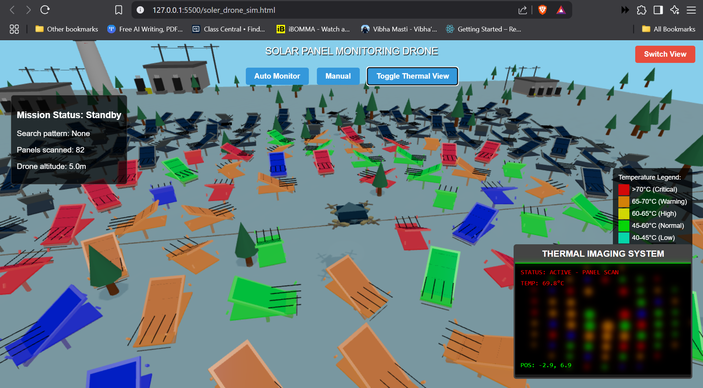

# Solar Panel Monitoring Drone Simulation

A web-based 3D simulation demonstrating drone-based solar panel monitoring using thermal imaging technology.



## Overview

This project simulates a drone system for monitoring solar panels using thermal imaging. It features a realistic 3D environment with a large solar farm, where the drone can detect and analyze panel temperatures to identify potential maintenance issues.

## Features

- **Realistic 3D Environment**
  - Large-scale solar panel array (15x15 grid)
  - Detailed terrain with natural variations
  - Power stations and maintenance equipment
  - Environmental elements (trees, lighthouse)

- **Drone System**
  - Detailed 3D drone model
  - Manual and automatic flight modes
  - Realistic physics and controls
  - Thermal imaging camera

- **Thermal Monitoring**
  - Real-time temperature detection
  - Color-coded temperature visualization
  - Temperature range classification (40-70°C)
  - Real-time data display

- **Control Modes**
  - Manual control with keyboard
  - Automatic spiral search pattern
  - Camera view switching
  - Smooth movement and rotation

## Getting Started

### Prerequisites

- Modern web browser with WebGL support
- Keyboard for manual control

### Installation

1. Clone the repository:
```bash
git clone https://github.com/yourusername/solar-panel-monitoring-drone-sim.git
```

2. Open the project directory:
```bash
cd solar-panel-monitoring-drone-sim
```

3. Open `soler_drone_sim.html` in your web browser

## Usage

### Controls

- **Manual Mode:**
  - Arrow keys: Move drone
  - W/S: Adjust altitude
  - Q/E: Rotate drone
  - Space: Toggle thermal view

- **Automatic Mode:**
  - Click "Auto Monitor" to start automatic scanning
  - Click "Manual" to return to manual control

### Temperature Legend

- Blue (<40°C): Too cold
- Cyan (40-45°C): Below optimal
- Green (45-60°C): Normal operating temperature
- Yellow (60-65°C): Getting hot
- Orange (65-70°C): Warning
- Red (>70°C): Critical

## Technical Details

### Technologies Used

- Three.js for 3D rendering
- WebGL for hardware acceleration
- JavaScript/HTML5/CSS3
- Modern browser APIs

### System Architecture

- Component-based design
- Event-driven architecture
- Real-time physics simulation
- Thermal detection algorithm

## Contributing

Contributions are welcome! Please feel free to submit a Pull Request.

## License

This project is licensed under the MIT License - see the LICENSE file for details.

## Acknowledgments

- Three.js community
- WebGL developers
- Open source contributors

## Contact

For any questions or suggestions, please open an issue in the repository.

